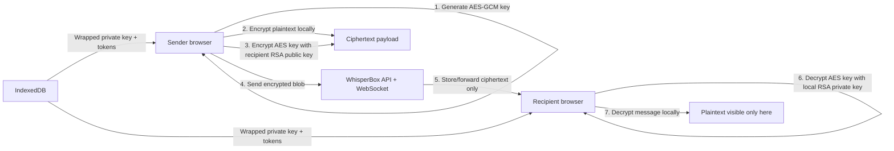

# WhisperBox Secure Messenger

A browser client for the WhisperBox E2EE backend at `https://whisperbox.koyeb.app`.
The server stores identities, tokens, public keys, wrapped private keys, and
encrypted message blobs. Plaintext messages and raw private keys stay on the
client.

## Architecture Diagram



## Encryption Flow

Registration:

1. The browser generates an RSA-OAEP 2048-bit key pair.
2. The public key is exported as base64 and sent to the backend.
3. The private key is exported locally, packaged for AES-KW compatibility, and
   wrapped with a password-derived AES-KW key.
4. The backend receives only `public_key`, `wrapped_private_key`, and
   `pbkdf2_salt`.

Login/session restore:

1. The backend returns the wrapped private key and PBKDF2 salt.
2. The browser derives the AES-KW wrapping key from the entered password.
3. The browser unwraps and imports the RSA private key in memory.
4. If the password is wrong, the private key cannot be restored.

Sending a message:

1. The browser creates an encrypted plaintext envelope containing `messageId`,
   `sentAt`, and `body`.
2. The browser generates a fresh AES-GCM 256-bit key and 96-bit IV.
3. The envelope is encrypted with AES-GCM.
4. The AES key is encrypted with the recipient's RSA-OAEP public key.
5. The AES key is also encrypted with the sender's RSA-OAEP public key so sent
   history can be read later.
6. The backend receives only `ciphertext`, `iv`, `encryptedKey`, and
   `encryptedKeyForSelf`.

Receiving a message:

1. The browser chooses `encryptedKey` for received messages or
   `encryptedKeyForSelf` for sent messages.
2. The RSA private key decrypts the AES message key.
3. AES-GCM decrypts the ciphertext envelope.
4. The UI displays only the envelope `body`.
5. Duplicate message IDs or suspicious timestamps are flagged as possible replay
   attempts.

## Key Management

- RSA-OAEP identity keys are generated client-side with Web Crypto.
- Public keys are stored on the backend and used by other users to send
  encrypted messages.
- Raw private keys never leave the browser.
- Private keys are wrapped with AES-KW using a PBKDF2-derived key from the
  user's password, a random 128-bit salt, SHA-256, and 210,000 iterations.
- Existing accounts created during earlier testing are still supported with a
  legacy 310,000-iteration unwrap fallback.
- IndexedDB stores session tokens, profile metadata, wrapped private keys, and
  salts. It does not store raw private keys.
- Raw private keys exist only in memory while the user is signed in/unlocked.

## Security Trade-Offs

- The server cannot read message plaintext, but it still sees metadata such as
  sender, recipient, timestamps, and conversation existence.
- Client-side replay detection can flag duplicated encrypted envelopes after
  decryption, but the server does not enforce replay rejection.
- Password-based private-key wrapping depends on password strength, so the UI
  includes a password strength hint during registration.
- Per-message AES keys limit key reuse, but this is not true forward secrecy
  because old message keys are encrypted to long-term RSA identity keys.
- Public key fingerprints are shown so users can compare keys, but there is no
  out-of-band verification workflow or key change alert yet.
- Access tokens are stored in IndexedDB for usability. A production app should
  additionally consider hardened browser storage and stricter device/session
  management.

## Known Limitations

- No double-ratchet or true forward secrecy.
- No server-side replay prevention.
- No attachment encryption.
- No multi-device key synchronization beyond password-based restore.
- No account recovery if the password is lost.
- No push notifications outside an active browser session.
- WebSocket reconnect behavior is basic; HTTP send fallback is used when realtime
  delivery is unavailable.

## Project Structure

- `src/crypto.ts` contains key generation, PBKDF2 wrapping, public-key
  fingerprints, AES-GCM message encryption, RSA-OAEP key encryption, and decrypt
  helpers.
- `src/api.ts` contains the WhisperBox HTTP and WebSocket client.
- `src/storage.ts` stores only tokens and wrapped key material in IndexedDB.
- `src/App.tsx` contains auth, session restore, user search, conversations,
  realtime delivery, replay warnings, security drawer UI, and graceful decryption
  failure states.

## Run Locally

```bash
npm install
npm run dev
```

The API is already configured for `https://whisperbox.koyeb.app`.

## Verification

```bash
npm run build
npm run lint
```
# e2ee-protocol-demo
